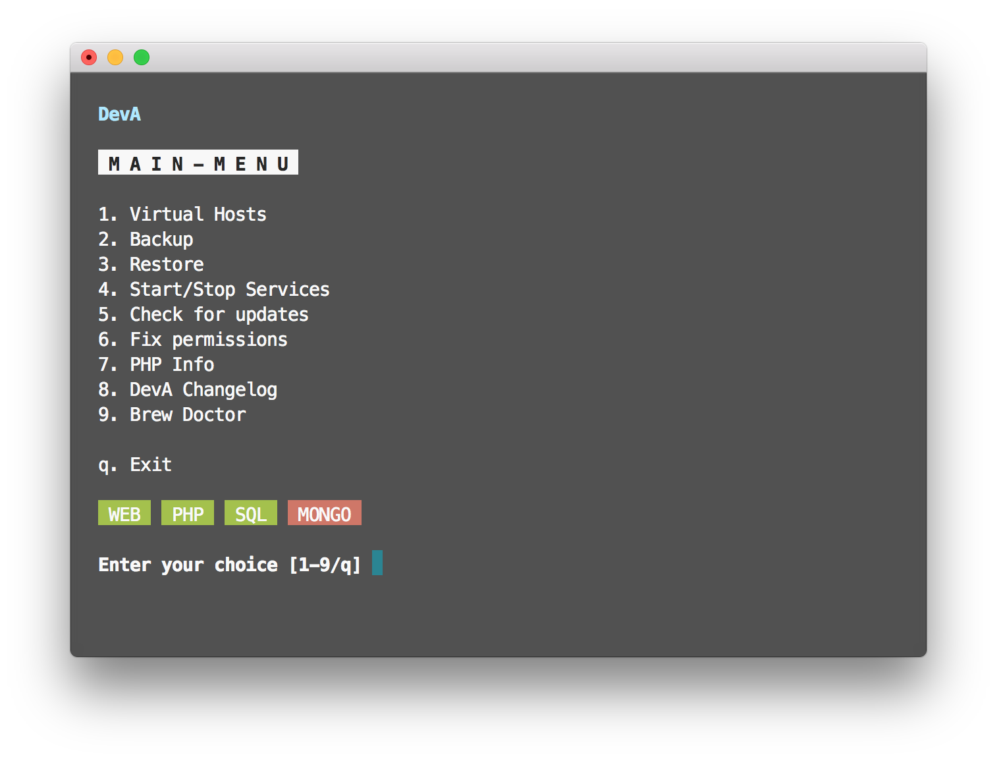

# DevA - Development Area

Configures a macOS or Ubuntu machine with the required packages and services for web development.

## Packages & Services Included

- Nginx
- PHP 7.2
- MySQL 5.7
- NodeJS
- Phalcon Extension
- Phalcon DevTools
- Composer
- MongoDB

## Requirements

- For macOS: High Sierra or newer
- For Linux: Ubuntu 16.04 or newer

## Setup

Run the following command in the Terminal:

`curl -SsL https://raw.githubusercontent.com/mignz/DevA/master/install > ~/deva-inst && chmod +x ~/deva-inst && ~/deva-inst`

or

`wget https://raw.githubusercontent.com/mignz/DevA/master/install -O ~/deva-inst && chmod +x ~/deva-inst && ~/deva-inst`

## Run the Control Panel

The DevA control panel is a CLI application so it must be run from the Terminal using the following command:

`$ dev`

## Updating DevA

If there is a new update available, go to the "Check for updates" page in the DevA control panel to automatically update.

## Database Access

|                         | **MySQL**                       | **MongoDB**                       |
|-------------------------|---------------------------------|-----------------------------------|
| **Address**             | 127.0.0.1                       | 127.0.0.1                         |
| **Port**                | 3306                            | 27017                             |
| **Username**            | root                            | root                              |
| **Password**            |                                 | root                              |
| **Remote Access**       | No                              | No                                |
| **macOS Start/Restart** | `$ brew services restart mysql` | `$ brew services restart mongodb` |
| **Linux Start/Restart** | `$ sudo service mysql restart`  | `$ sudo service mongodb restart`  |
